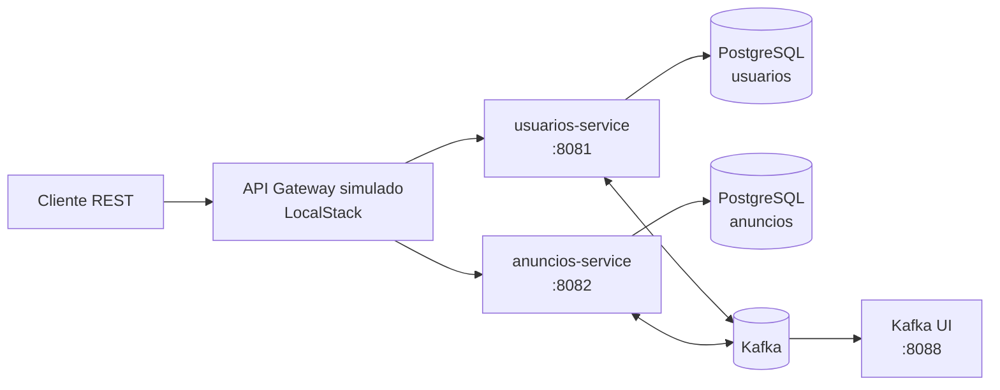

# Webmotors Microservices

Projeto de estudo para construção de uma plataforma de anúncios de veículos com arquitetura de microsserviços. O objetivo é praticar desenvolvimento backend, comunicação síncrona e assíncrona, persistência isolada por serviço, observabilidade e execução containerizada.

## Status do projeto

O projeto está em desenvolvimento incremental. A primeira fatia funcional já pode ser executada localmente com Docker Compose:

- `usuarios-service`: cadastro, consulta e desativação de usuários.
- `anuncios-service`: cadastro e consulta de anúncios, incluindo consulta por usuário.
- PostgreSQL isolado para cada serviço.
- Kafka para eventos de integração entre os domínios.
- LocalStack com API Gateway simulado para testes de entrada única.
- Kafka UI para inspeção dos tópicos durante o desenvolvimento.

Os módulos `gateway/`, `pagamentos-service/` e `notificacoes-service/` ainda representam a evolução planejada e não devem ser considerados componentes produtivos neste momento. Para o desenvolvimento local, o API Gateway é simulado pelo LocalStack.

## Arquitetura atual



Cada serviço mantém sua própria base de dados e possui ciclo de build independente. A comunicação orientada a eventos é usada para reduzir acoplamento entre os domínios. O consumidor de desativação de anúncios, por exemplo, processa eventos de usuários de forma idempotente e registra métricas da operação.

## Tecnologias e práticas

- Java 21
- Spring Boot e Spring Data JPA
- Spring Security
- Spring Kafka
- PostgreSQL 16
- Flyway para versionamento do schema
- Resilience4j, OpenFeign e Spring Cloud LoadBalancer
- Actuator, Micrometer e Prometheus Registry
- Docker Compose
- LocalStack e Kafka UI para desenvolvimento local
- Testes com JUnit e Spring Boot Test

## Funcionalidades implementadas

### Usuários

- Criar e listar usuários.
- Desativar um usuário.
- Persistir dados em PostgreSQL com migration Flyway.
- Publicar eventos de domínio no Kafka.
- Expor health check via Actuator.

### Anúncios

- Criar e listar anúncios.
- Listar anúncios de um usuário.
- Persistir dados em banco próprio.
- Consumir eventos de desativação de usuários.
- Evitar reprocessamento de eventos já tratados.
- Expor métricas de lotes, usuários e anúncios processados.

## Como executar

### Pré-requisitos

- Docker Engine.
- Docker Compose.
- Portas livres: `4566`, `5433`, `5434`, `8081`, `8082`, `8088` e `9092`.

### Inicialização

Na raiz deste projeto, execute:

```bash
docker compose up --build -d
```

O Compose inicializa os bancos, Kafka, Kafka UI, LocalStack e os dois serviços implementados. Para acompanhar os logs:

```bash
docker compose logs -f
```

Para conferir o estado dos containers:

```bash
docker compose ps
```

### Teste rápido das APIs

Os serviços usam a configuração padrão do Spring Security durante o desenvolvimento. A senha gerada pode ser consultada nos logs:

```bash
docker compose logs usuarios-service | tail -n 50
```

Health checks diretos:

```bash
curl http://localhost:8081/actuator/health
curl http://localhost:8082/actuator/health
```

Também é possível executar o fluxo completo pelo arquivo `requests.http`, usando a extensão REST Client do VS Code. O arquivo está configurado para passar pelo API Gateway disponibilizado pelo LocalStack:

1. Criar um usuário e copiar o `id` retornado.
2. Atualizar `@usuarioId` no arquivo.
3. Criar um anúncio associado ao usuário.
4. Consultar usuários e anúncios.
5. Desativar o usuário e validar o processamento do evento no `anuncios-service`.

O arquivo `insomnia-export.json` contém as mesmas chamadas organizadas para importação no Insomnia.

### Encerramento

Para parar os containers preservando os dados locais:

```bash
docker compose down
```

Para remover também os volumes dos bancos:

```bash
docker compose down -v
```

## Próximas etapas

- Implementar o `gateway/` como serviço Spring Cloud Gateway.
- Definir a estratégia de descoberta e roteamento para um ambiente de deploy, mantendo o LocalStack como simulação local do API Gateway.
- Completar `pagamentos-service` e `notificacoes-service` com casos de uso, persistência e contratos de integração.
- Padronizar versões do Spring Boot e Spring Cloud entre os módulos.
- Expandir testes unitários, de integração e de contrato, incluindo cenários de falha e reprocessamento Kafka.
- Configurar autenticação e autorização com usuários, roles e gestão segura de credenciais.
- Externalizar segredos e configurações sensíveis, removendo valores de desenvolvimento do Compose.
- Adicionar CI com build, testes, análise estática e verificação de vulnerabilidades.
- Definir observabilidade completa com logs estruturados, tracing distribuído e dashboards.
- Criar manifests de deploy e infraestrutura como código para um ambiente de nuvem.

## Desenvolvimento

As mudanças devem preservar o isolamento entre os domínios e a independência de deploy dos serviços. Antes de abrir uma contribuição, execute o build e os testes do serviço alterado, além de validar o fluxo integrado pelo Compose.

Este repositório é um projeto de estudo em evolução. As decisões de arquitetura e os componentes listados como próximos passos fazem parte do plano de aprendizado e não representam funcionalidades concluídas.
